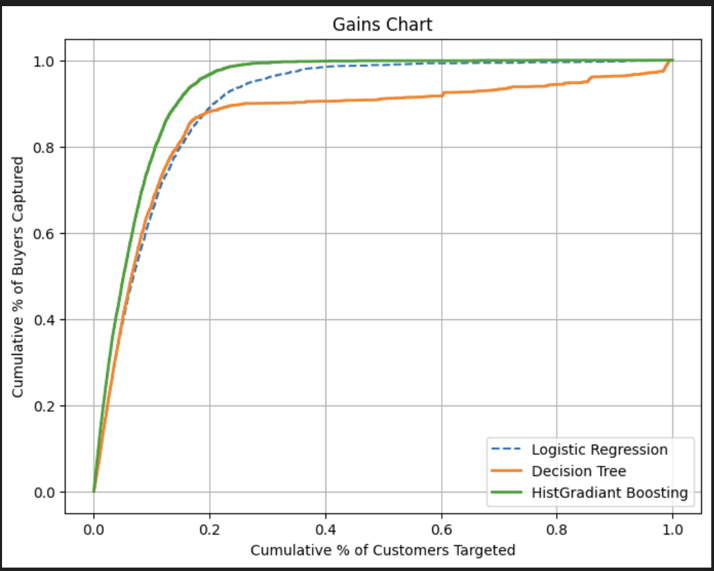
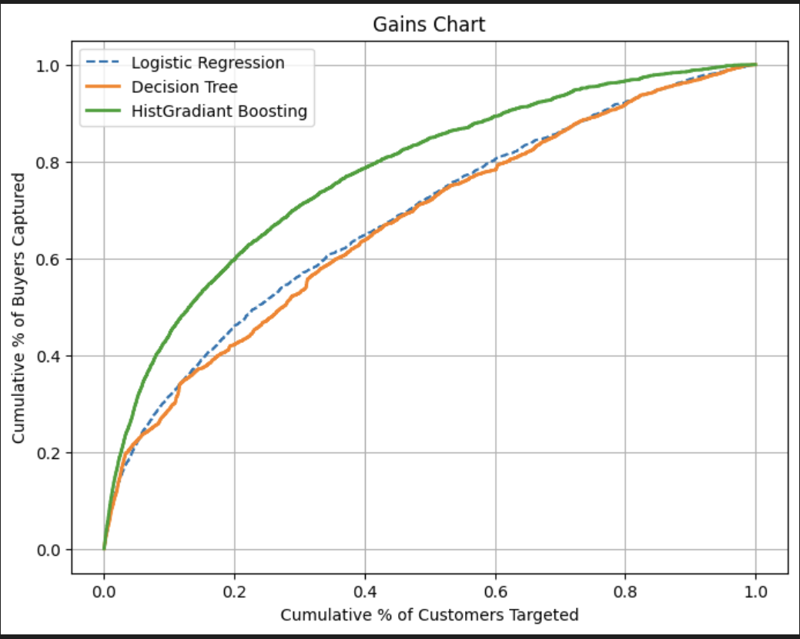
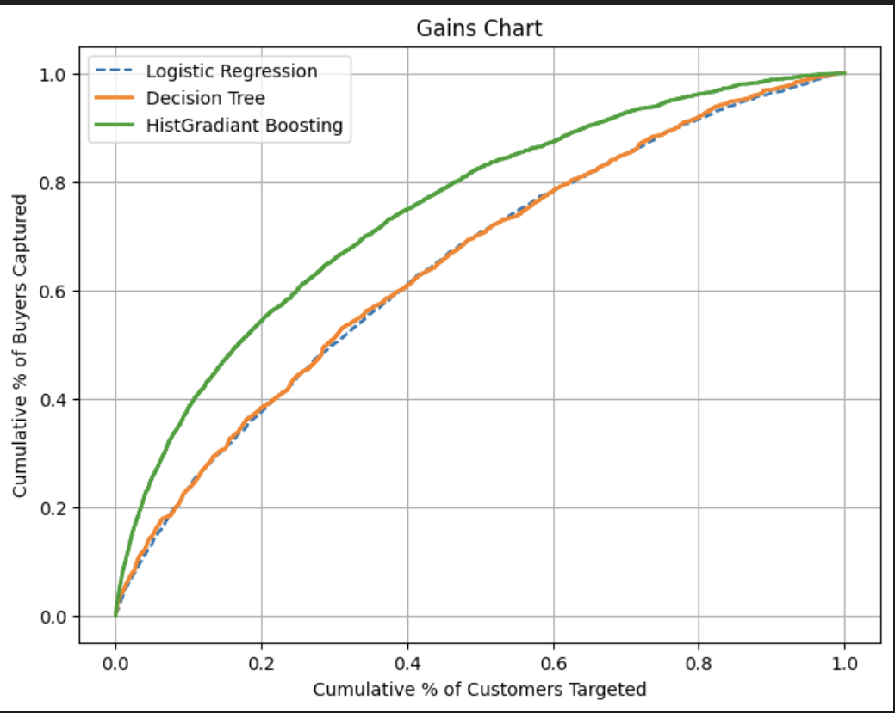

# Term Deposit Marketing – Customer Targeting Model

## Project Overview

This project develops a machine learning system to predict whether a customer will subscribe to a term deposit product based on historical call center marketing data from a European banking institution.

The business objective is:

> **Rank customers by likelihood of subscription and maximize marketing efficiency.**

Although the original success metric required ≥81% accuracy, this dataset is highly imbalanced (only 7.24% positive class). Therefore, the final model is evaluated primarily using:

* **Lift**
* **Top-Decile Capture Rate**
* **ROC-AUC**

These metrics better reflect real-world marketing performance than raw accuracy.

---

# Dataset Summary

* **40,000 customer records**
* Binary target variable: `y` (yes/no)
* Severe class imbalance:

  * 92.76% "No"
  * 7.24% "Yes"

## Feature Groups

**Demographics**

* age
* job
* marital
* education

**Financial**

* balance
* default
* housing loan
* personal loan

**Campaign**

* contact type
* campaign count
* month
* day
* duration

---

## Data Leakage Consideration

The feature **`duration` (call length)** is only known *after* a call has started. Including it would result in post-outcome prediction rather than realistic pre-call targeting.

Therefore:

> `duration` was excluded from the final production model.

This ensures the system can be used **before making calls**, which aligns with the real marketing objective.

---

# Modeling Strategy

Multiple models were evaluated:

* Logistic Regression
* Decision Trees
* Random Forest
* HistGradientBoostingClassifier

Given class imbalance and the ranking objective, models were evaluated using:

* Accuracy
* Precision / Recall / F1
* ROC-AUC
* Gains Chart
* Lift

We used **5-fold Stratified Cross-Validation** to ensure robustness.

---

# Final Production Model

### Selected Model:

**HistGradientBoostingClassifier**

### Why Gradient Boosting?

* Captures non-linear feature interactions
* Strong ranking performance
* Stable cross-validation ROC-AUC
* Superior Lift compared to linear models
* Handles categorical encoding via pipeline

---

# Final Model Performance (5-Fold CV)

### Mean ROC-AUC:

```
0.7193
```

While raw accuracy is high due to class imbalance, ROC-AUC and Lift provide a more realistic evaluation of marketing effectiveness.

---

# Lift Analysis (Primary Business Metric)

```
------ Lift Analysis ------

Top 10%:
  Capture Rate: 0.3661
  Lift: 3.66

Top 20%:
  Capture Rate: 0.4888
  Lift: 2.44

Top 30%:
  Capture Rate: 0.5955
  Lift: 1.98

Top 50%:
  Capture Rate: 0.7528
  Lift: 1.51
```

---

## Interpretation

If the marketing team targets:

* **Top 10% of ranked customers**
* They capture **36.6% of all actual subscribers**

Since only 7.24% of customers subscribe overall:

* Random 10% targeting → ~7.24% capture
* Model Top 10% → 36.6% capture

This represents:

> **3.66× improvement over random targeting**

This is a substantial increase in marketing efficiency.

---

# Gains Analysis

<table>
<tr>
<td align="center">
<b>All Columns</b><br>

</td>

<td align="center">
<b>No Duration</b><br>

</td>

<td align="center">
<b>No Duration & Month</b><br>

</td>
</tr>
</table>

The final model (excluding duration) provides strong ranking ability while remaining production-realistic.

---

# Key Business Insights

Customers more likely to subscribe:

* Higher account balance
* Lower number of previous campaign contacts
* Certain marital profiles
* Contacted via cellular
* Seasonality effects observed in specific months

### Practical Strategy:

Focus calling efforts on the top 10–20% ranked customers for maximum ROI.

---

# Addressing the 81% Accuracy Requirement

The original success metric required ≥81% accuracy.

However, due to severe class imbalance:

* A naïve model predicting all "No" would already achieve ~92.76% accuracy.
* Therefore, accuracy alone is not an appropriate metric.

Instead, Lift and ROC-AUC were prioritized as they better measure:

* Customer ranking quality
* Marketing efficiency
* Business impact

---

# Production Implementation

The final system uses a full preprocessing + modeling pipeline.

### Pipeline Components:

* `ColumnTransformer`
* `OneHotEncoder`
* `HistGradientBoostingClassifier`

This ensures:

* Consistent preprocessing at inference
* Safe handling of unseen categories
* No feature mismatch
* Reproducible training

---

# Saved Artifacts

```
models/
├── hgb_model.joblib
├── metadata.json
```

Metadata includes:

* Model version
* Hyperparameters
* CV metrics
* Feature lists
* Class distribution

---

# Scripts

## Train Model

```
python src/train.py
```

Outputs:

* 5-fold CV metrics
* ROC-AUC
* Lift analysis
* Saved model + metadata

---

## Generate Predictions

```
python src/predict.py --save_output
```

Supports:

* CSV input
* Excel input
* Custom classification threshold

Outputs:

* Predicted probability
* Predicted label

---

## Identify Target Segment

```
python src/target_segment.py
```

Returns:

* Top 10% customer list for marketing prioritization

---

# Repository Structure

```
├── data/       # Dataset not publicly available (privacy restrictions)
├── notebooks/
│   ├── 01_eda.ipynb
│   ├── 02_base_model.ipynb
│   ├── 03_modeling.ipynb
├── src/
│   ├── hyper_param_tuning.py
│   ├── train.py
│   ├── predict.py
│   ├── target_segment.py
├── models/
│   ├── hgb_model.joblib
│   ├── metadata.json
├── README.md
├── requirements.txt
```

---